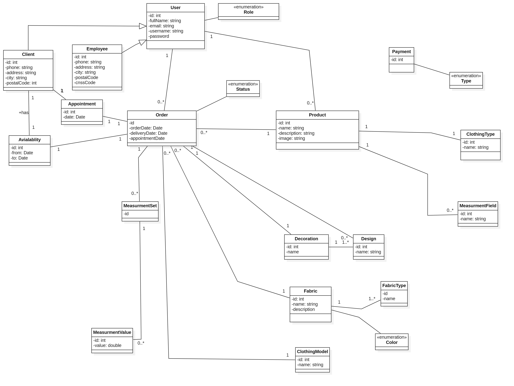

# Sophinia – E-commerce Application for Traditional Moroccan Clothing

## 📌 Introduction
**Sophinia** is a clothing brand specialized in **traditional Moroccan wear**.  
The application is designed as an **e-commerce platform** that allows customers to **personalize their products**, while also providing a **complete management solution** for tailoring workshops.

---

## 🚀 Key Features

### 👤 Customer
- Product customization workflow:
    1. Choose a product category
    2. Select fabric (type and color)
    3. Get a price estimation
    4. Schedule an appointment
    5. Place an order
- Real-time tracking of the total product cost
- Authentication as a visitor or registered customer
- Dashboard with:
    - Purchase history
    - Tracking of products in production

---

### 🛠️ Super Administrator
- Secure authentication
- Manage users with roles (employee, administrator, etc.)
- Access customer orders
- Appointment management:
    - Schedule according to customer availability
    - Assign appointments to employees
- Production process management:
    - Take customer measurements
    - Estimate and propose final product price
    - Update product status (tailoring, assembling, finishing, completed)
    - Notify customers when the product is ready
- Financial management:
    - Track payments (paid / unpaid)
    - Generate invoices
    - Manage expenses
- Human resources:
    - Add employees with badges (tailor, assembler, other, full)
    - Manage employee payroll
- Manage suppliers

---

### 👷 Employee
- Authenticate on the platform
- Access assigned product list
- Visit customers to take measurements
- Update product status according to progress

---

## 🏗️ Architecture & Technologies
- **Frontend**: (e.g., React, Angular, or Vue) – Responsive and intuitive user interface
- **Backend**: (e.g., Spring Boot, Laravel, Node.js) – API and business logic
- **Database**: (e.g., MySQL, PostgreSQL) – Customer, order, and production management
- **Authentication**: JWT or OAuth2 for secure access
- **Notifications**: Email / SMS to keep customers updated

*(Replace with the actual technologies used in your project)*

---

## 📈 Benefits
- Modernizes the sale of traditional Moroccan clothing
- Simplifies tailoring workshop management
- Enhances customer experience with personalization and order tracking
- Centralizes operations: orders, production, finances, and human resources

---

## 🔮 Future Enhancements
- Mobile application (iOS & Android)
- Online payment integration (e.g., Stripe, PayPal)
- Advanced analytics for sales and production
- Multi-language support

---

## 📄 License
This project is licensed under the MIT License – see the [LICENSE](LICENSE) file for details.

## 🧩 UML Diagrams

### ✅ Use Case Diagram

### 🏛️ Class Diagram

### 🔄 Client Sequence Diagram

### 🔄 Admin Sequence Diagram
